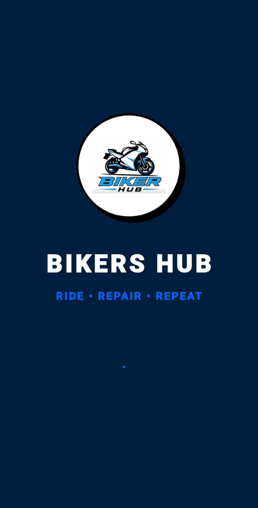

# Bikers Hub

## Overview

Bikers Hub is a Flutter-based mobile application developed as a Final Year Project for Software Engineering. The platform is designed to enhance the experience of motorcycle enthusiasts by providing essential biking services and community features in a single application.

The application helps riders connect with nearby mechanics, share live locations during emergencies, plan trips, buy and sell motorcycles, engage with the biking community, and access DIY maintenance resources.

## Features

### Live Location Sharing

Enables riders to share their real-time location with Emergency Contacts like friends, family, or fellow bikers to improve safety and coordination during rides.

### Emergency SOS Support

Allows users to quickly share their location during emergencies and seek assistance when needed.

### Mechanic Locator

Helps riders find nearby mechanics and repair services during breakdowns or unexpected situations.

### Bike Marketplace

Provides a platform for users to buy, sell, and explore motorcycles and biking accessories.

### Trip Planning

Assists users in organizing trips with fellow riders.

### Bikers Community

Creates a space where motorcycle enthusiasts can connect, interact, and share their experiences.

### DIY Garage

Offers guidance and repairing video tutorials for basic motorcycle maintenance and troubleshooting.

## Technology Stack

### Frontend

* Flutter
* Dart

### Backend & Database

* Firebase Authentication
* Cloud Firestore
* Firebase Storage

### APIs & Services

* OpenStreetMap
* Real-Time Location Services

## Future Enhancements

* Push Notifications
* Enhanced Community Features
* Advanced Trip Analytics
* Route Optimization
* In-App Chat Improvements
* Weather Widget
* Fuel Stations Locator

## Author

**Aleesha Tariq**

Software Engineering Graduate

LinkedIn: [www.linkedin.com/in/aleesha-tariq-se](http://www.linkedin.com/in/aleesha-tariq-se)

GitHub: github.com/Aleesha1234

## Screenshots 
### Splash Screen

